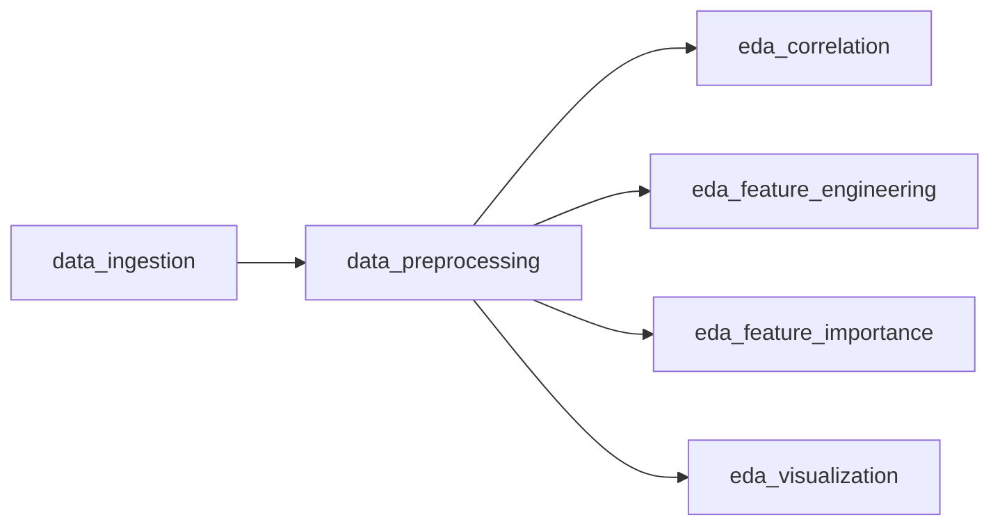

# Bank Customer Churn - Cloud Data Science Pipeline

Implementation of Sub-Objective 1 (data pipeline) from [ProblemStatement.md](ProblemStatement.md).
This README is also the walkthrough for the grader: it maps every activity in
the problem statement to the module that implements it and the evidence it
produces.

## 1. Business understanding (activity 1.1)

Retail banks lose a large share of revenue to silent attrition - customers who
stop using their account and leave without warning. The business question is:
**which customers are most likely to churn, and which attributes signal it
early**, so the retention team can intervene before the customer leaves.

## 2. Dataset (activity 1.2)

| Item | Detail |
| --- | --- |
| Source | Kaggle - Bank Customer Churn Prediction |
| File | [dataset/BankCustomerChurnPrediction.csv](dataset/BankCustomerChurnPrediction.csv) |
| Records | 10,000 customers x 14 columns |
| Target | `Exited` (1 = churned, 0 = retained) - ~20.4% churn rate |
| Features | `CreditScore`, `Geography`, `Gender`, `Age`, `Tenure`, `Balance`, `NumOfProducts`, `HasCrCard`, `IsActiveMember`, `EstimatedSalary` |

## 3. Pipeline flow



Every module exposes a `run()` entry point, is independently runnable, and logs
each step - so the same modules can be wrapped as orchestrated tasks for the
DataOps stage (activity 1.5) without modification.

## 4. Module map (what to grade where)

| Activity | Module | What it does | Evidence |
| --- | --- | --- | --- |
| 1.2 Ingestion | [tasks/data_ingestion.py](tasks/data_ingestion.py) | Loads the CSV, validates that required columns exist, logs shape and churn rate | Console log |
| 1.3 Pre-processing | [tasks/data_preprocessing.py](tasks/data_preprocessing.py) | Summary statistics, missing-value check, median imputation of numeric columns, data-type report, Min-Max normalisation | `output/processed_bank_churn.csv` |
| 1.4 EDA - correlation | [tasks/eda_correlation.py](tasks/eda_correlation.py) | Pearson correlation matrix, Pearson r + p-value for a numeric pair, chi-square independence tests for categorical vs churn | `output/correlation_heatmap.png` |
| 1.4 EDA - binning & encoding | [tasks/eda_feature_engineering.py](tasks/eda_feature_engineering.py) | Equal-width binning (Age), equal-depth binning (CreditScore), one-hot (Geography), binary (Gender), label encoding (Age band) | `output/encoded_bank_churn.csv` |
| 1.4 EDA - feature importance | [tasks/eda_feature_importance.py](tasks/eda_feature_importance.py) | Decision Tree + Random Forest trained on an 80/20 stratified split, accuracy and ranked importances | `output/dt_feature_importance.png`, `output/rf_feature_importance.png` |
| 1.4 EDA - visualisation | [tasks/eda_visualization.py](tasks/eda_visualization.py) | Univariate (churn count, numeric histograms) and bivariate (boxplot, scatter, facet grid) charts | 5 PNGs in `output/` |
| shared | [tasks/config.py](tasks/config.py) | Paths, column groupings, logger used by all tasks | - |

## 5. Setup

```bash
cd API_Driven
python3 -m venv .venv          # first time only
source .venv/bin/activate
python -m pip install -r requirements.txt
```

## 6. Run the pipeline

Run the modules in order from the `API_Driven` directory:

```bash
python -m tasks.data_ingestion
python -m tasks.data_preprocessing
python -m tasks.eda_correlation
python -m tasks.eda_feature_engineering
python -m tasks.eda_feature_importance
python -m tasks.eda_visualization
```

Each command prints a timestamped log of what it computed. All artefacts are
written to `output/` (created automatically).

## 7. Run the scheduled DataOps workflow (activity 1.5)

The Prefect workflow wraps the same modules as observable tasks and runs them
in sequence. To execute it once and return to the shell:

```bash
python -c "from flows.bank_churn_dataops import bank_customer_churn_flow; bank_customer_churn_flow()"
```

To keep a local deployment running and trigger the workflow every 2 minutes:

```bash
python flows/bank_churn_dataops.py
```

The Prefect UI can be used to inspect flow runs, task logs, retries and status.
The `bank-customer-churn-dataops` flow contains ingestion, preprocessing,
correlation, feature engineering, feature importance and visualization tasks.

## 8. Expected results

* **Pre-processing** - 10,000 rows, no missing values detected; identifier
  columns (`RowNumber`, `CustomerId`, `Surname`) dropped; 6 numeric features
  scaled into `[0, 1]` as `<column>_normalized`.
* **Correlation** - `Age` and `IsActiveMember` show the strongest relationship
  with churn; chi-square confirms `Geography`, `Gender` and `IsActiveMember`
  are associated with churn while `HasCrCard` is independent (p ≈ 0.49).
* **Feature importance** - `Age`, `NumOfProducts` and `Balance` dominate both
  tree models, which agrees with the correlation findings.
* **Interpretation** - older, inactive customers holding few products are the
  highest-risk segment for the retention campaign.

## 9. Programmatic use

```python
from tasks.data_ingestion import load_bank_customer_churn_data
from tasks.data_preprocessing import preprocess

data = load_bank_customer_churn_data()
clean = preprocess(data)
print(clean.head())
```

